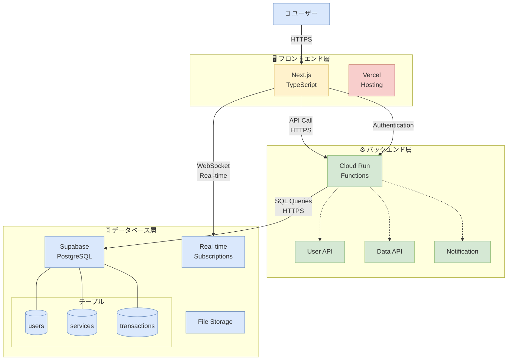

# Capu システム構成図

## 主要コンポーネント

### フロントエンド層
- **Next.js (TypeScript)**: メインのWebアプリケーション
- **Vercel**: ホスティングプラットフォーム

### バックエンド層
- **Cloud Run (Functions)**: サーバーレスコンテナ実行環境（認証エンドポイントを含む）
- **User API**: ユーザー管理API
- **Data API**: データ操作API
- **Notification**: 通知機能

### データベース層
- **Supabase (PostgreSQL)**: メインデータベース
- **Real-time Subscriptions**: リアルタイム更新機能
- **File Storage**: ファイル保存機能

#### データベーステーブル
- **users**: ユーザー情報
- **services**: サービス情報
- **transactions**: 取引履歴

## データフロー

1. **ユーザー認証フロー**
   - ユーザー → Next.js → Cloud Run Functions
   - Cloud Run Functions → Supabase (RLS Security)

2. **API通信フロー**
   - Next.js → Cloud Run Functions → Supabase

3. **リアルタイム通信フロー**
   - Next.js ↔ Supabase Real-time Subscriptions (WebSocket)

## 技術スタック

| 層 | 技術 | 用途 |
|---|---|---|
| フロントエンド | Next.js (TypeScript) | Webアプリケーション |
| ホスティング | Vercel | フロントエンドデプロイ |
| バックエンド | Cloud Run (Functions) | サーバーレス処理 |
| 認証 | Cloud Run (Functions) | ユーザー認証 |
| データベース | Supabase (PostgreSQL) | データ永続化 |
| リアルタイム | Supabase Real-time | WebSocket通信 |
| ストレージ | Supabase Storage | ファイル保存 |