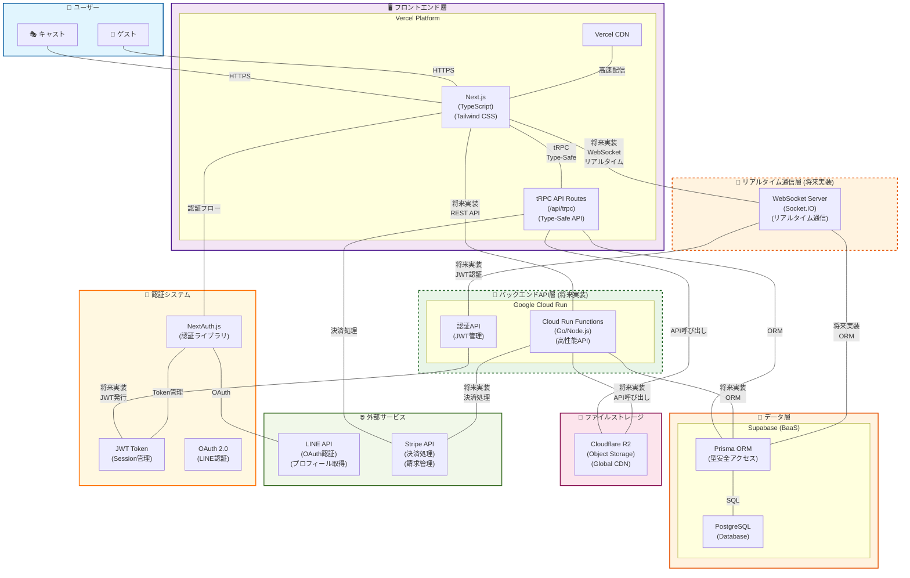

# Capuシステム構成図

## 概要
このドキュメントは、Capuシステムの全体的なシステム構成とアーキテクチャを図示したものです。
T3 Stackをベースとしたモダンなサーバーレスアーキテクチャを採用しています。

## システム構成図



## 各層の詳細説明

### 1. ユーザー層 (👥 Users)
- **キャスト**: サービス提供者（エンターテイナー）
- **ゲスト**: サービス利用者（顧客）
- 両ユーザーともHTTPS通信でフロントエンドアプリケーションにアクセス

### 2. フロントエンド層 (🖥️ Frontend)
#### Vercel Platform
- **Next.js**: Reactベースのフルスタックフレームワーク
- **TypeScript**: 型安全性を提供する静的型付け言語
- **Tailwind CSS**: ユーティリティファーストのCSSフレームワーク
- **tRPC API Routes**: `/api/trpc` エンドポイントで提供される型安全なAPI層
  - `apps/cast/src/pages/api/trpc/[trpc].ts`
  - `apps/guest/src/pages/api/trpc/[trpc].ts`
- **Vercel CDN**: 世界規模での高速コンテンツ配信

### 3. バックエンドAPI層 (🔧 将来実装)
#### Google Cloud Run
- **Cloud Run Functions**: 高性能なバックエンドAPI（Go/Node.js）
  - 複雑なビジネスロジック処理
  - 高負荷処理対応
  - マイクロサービス化
- **認証API**: JWT管理とセキュリティ処理
- サーバーレスコンテナによる自動スケーリング

### 4. リアルタイム通信層 (🔄 将来実装)
- **WebSocket Server**: Socket.IOベースのリアルタイム通信サーバー（将来実装予定）
  - リアルタイムメッセージング
  - 既読状態管理
  - 入力中ステータス表示
  - 未読バッジ更新
  - オンライン状態管理

### 5. データ層 (💾 Data Layer)
#### Supabase (BaaS)
- **PostgreSQL**: メインデータベース
- **Prisma ORM**: 型安全なデータベースアクセス層
- 主要テーブル: `users`, `casts`, `cast_applications`

### 6. ファイルストレージ層 (📁 Storage)
- **Cloudflare R2**: オブジェクトストレージ
- 画像、動画、ドキュメントの管理
- グローバルCDNによる高速配信

### 7. 外部サービス層 (🌐 External Services)
- **LINE API**: OAuth認証、プロフィール取得、通知送信
- **Stripe API**: 決済処理、請求管理、顧客管理

### 8. 認証システム (🔐 Auth System)
- **NextAuth.js**: Next.js用包括的認証ソリューション
- **JWT Token**: ステートレスなセッション管理
- **OAuth 2.0**: LINE認証プロトコル

## データフロー

### 1. ユーザー認証フロー
```
ユーザー → NextAuth.js → LINE OAuth → JWT発行 → セッション確立
```

### 2. 現在のデータアクセスフロー
```
フロントエンド → tRPC API Routes (/api/trpc) → Prisma ORM → PostgreSQL
```

### 3. 将来のデータアクセスフロー（Cloud Run Functions）
```
フロントエンド → REST API → Cloud Run Functions → Prisma ORM → PostgreSQL
```

### 4. リアルタイム通信フロー（将来実装）
```
フロントエンド → WebSocket → Socket.IO Server → Prisma ORM → PostgreSQL
```

### 5. 現在のファイルアクセスフロー
```
フロントエンド → tRPC API Routes → Cloudflare R2 API → オブジェクトストレージ
```

### 6. 将来のファイルアクセスフロー（Cloud Run Functions）
```
フロントエンド → REST API → Cloud Run Functions → Cloudflare R2 API → オブジェクトストレージ
```

### 7. 現在の決済処理フロー
```
フロントエンド → tRPC API Routes → Stripe API → 決済処理
```

### 8. 将来の決済処理フロー（Cloud Run Functions）
```
フロントエンド → REST API → Cloud Run Functions → Stripe API → 決済処理
```

## アーキテクチャの特徴

### 1. 型安全性 (Type Safety)
- **TypeScript + tRPC**: エンドツーエンドの完全型安全
- **Prisma**: データベースアクセスの型安全性
- 開発時エラー検出とコード品質向上

### 2. サーバーレスアーキテクチャ
- **Vercel**: フロントエンドとAPI Routesの自動スケーリング
- 運用コスト最適化と高可用性

### 3. JAMstack アプローチ
- **JavaScript**: 動的機能
- **APIs**: tRPC API Routesとマイクロサービス連携
- **Markup**: 静的コンテンツ
- 高性能と優れたSEO

### 4. T3 Stack構成
- **Next.js**: フルスタックフレームワーク
- **tRPC**: 型安全なAPI通信（Next.js API Routes）
- **Prisma**: 型安全なORM
- **NextAuth.js**: 認証システム
- **TypeScript**: 型安全性

### 5. 将来のリアルタイム通信（実装予定）
- **WebSocket**: Socket.IOによる双方向通信
- **リアルタイムメッセージング**: 即座のメッセージ配信
- **状態同期**: 既読状態・オンライン状態の同期
- **イベント配信**: 入力中、通知などのリアルタイムイベント

### 6. 将来のマイクロサービス指向（実装予定）
- **フロントエンド**: Vercel Platform（Next.js + tRPC API Routes）
- **バックエンドAPI**: Google Cloud Run Functions（高性能API）
- **リアルタイム通信**: WebSocket Server（Socket.IO）
- **独立したデプロイメント**: 各サービスの独立した運用
- **技術スタックの柔軟性**: 最適な技術選択

## セキュリティ考慮事項

### 1. 通信セキュリティ
- **HTTPS**: 全通信の暗号化
- **CORS**: 適切なオリジン制御
- **CSP**: コンテンツセキュリティポリシー

### 2. 認証・認可
- **LINE OAuth**: 信頼性の高い外部認証
- **JWT**: ステートレス認証トークン
- **NextAuth.js**: セキュアな認証フロー

### 3. データ保護
- **Supabase**: エンタープライズグレードのセキュリティ
- **Cloudflare R2**: グローバルセキュリティ
- **暗号化**: 保存データと転送データの暗号化

## パフォーマンス最適化

### 1. CDN活用
- **Vercel CDN**: 静的アセットの高速配信
- **Cloudflare R2**: ファイルの世界規模配信
- エッジロケーションでの最適化

### 2. サーバーレス最適化
- **Vercel Functions**: API Routesの最適化
- **Cloud Run Functions**: 高性能バックエンドAPI最適化（将来実装）
- **Connection Pooling**: データベース接続最適化
- **Caching Strategy**: 適切なキャッシュ戦略

### 3. フロントエンド最適化
- **Next.js**: SSR/SSGによる最適化
- **Code Splitting**: 必要な部分のみ読み込み
- **Image Optimization**: 自動画像最適化

## 運用・監視

### 1. ログ管理
- **Vercel Analytics**: フロントエンド・API Routes監視
- **Cloud Run Monitoring**: バックエンドAPI監視（将来実装）
- **WebSocket Monitoring**: リアルタイム通信監視（将来実装）
- **Supabase Monitoring**: データベース監視

### 2. エラーハンドリング
- **tRPC Error Boundary**: API エラー処理
- **Next.js Error Pages**: フロントエンドエラー処理
- **Graceful Degradation**: 段階的機能縮退

## 現在の実装状況

### ✅ 実装済み
- Next.js アプリケーション（キャスト・ゲスト）
- tRPC API Routes (`/api/trpc`)
- NextAuth.js認証システム
- Prisma ORM + Supabase
- TypeScript型安全性

### 🚧 実装予定
- **Cloud Run Functions**: 高性能バックエンドAPI
- **WebSocket Server**: リアルタイム通信（Socket.IO）
- **Cloudflare R2**: ファイルストレージ
- **Stripe決済**: 決済システム
- **認証API**: JWT管理システム

## 移行戦略

### Phase 1: 現在（tRPC API Routes）
- 基本的なCRUD操作
- 認証・認可
- 軽量なビジネスロジック

### Phase 2: 将来（Cloud Run Functions）
- 複雑なビジネスロジック
- 高負荷処理
- マイクロサービス化
- 高性能なファイル処理

### Phase 3: 完全移行
- tRPC API Routesから段階的移行
- パフォーマンス最適化
- 負荷分散

## 制約事項・考慮点

### 1. ベンダーロックイン
- **現在**: Vercel、Supabaseへの依存
- **将来**: Google Cloud Run、Cloudflare、Stripeへの依存拡大
- 移行コストとリスクの考慮

### 2. 現在のパフォーマンス制約
- Vercel Functionsの実行時間制限
- API制限とレート制限

### 3. 将来のパフォーマンス制約
- Cloud Run Functionsのコールドスタート
- WebSocket接続数の制限
- 別途WebSocketサーバーが必要

### 4. 移行時の考慮事項
- **段階的移行**: 既存システムとの互換性維持
- **データ整合性**: 移行中のデータ同期
- **パフォーマンス影響**: 移行期間中の性能低下リスク
- **運用負荷**: 複数システムの同時運用

### 5. コスト管理
- **現在**: Vercel、Supabaseの使用量ベース料金
- **将来**: Cloud Run、Cloudflare R2、Stripeの料金追加
- スケール時のコスト増加とマルチクラウド管理

---

**作成日**: 2024年12月  
**更新日**: 2024年12月  
**作成者**: Capu開発チーム  
**参照**: [技術スタック.md](./技術スタック.md)