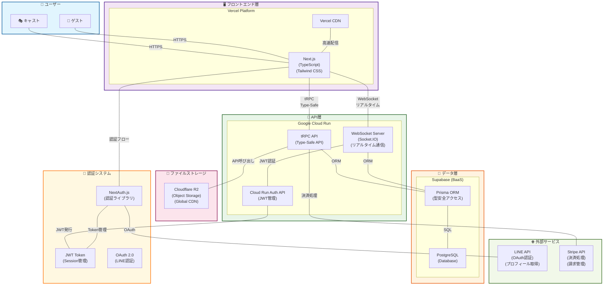

# Capuシステム構成図

## 概要
このドキュメントは、Capuシステムの全体的なシステム構成とアーキテクチャを図示したものです。
T3 Stackをベースとしたモダンなサーバーレスアーキテクチャを採用しています。

## システム構成図



## 各層の詳細説明

### 1. ユーザー層 (👥 Users)
- **キャスト**: サービス提供者（エンターテイナー）
- **ゲスト**: サービス利用者（顧客）
- 両ユーザーともHTTPS通信でフロントエンドアプリケーションにアクセス

### 2. フロントエンド層 (🖥️ Frontend)
#### Vercel Platform
- **Next.js**: Reactベースのフルスタックフレームワーク
- **TypeScript**: 型安全性を提供する静的型付け言語
- **Tailwind CSS**: ユーティリティファーストのCSSフレームワーク
- **Vercel CDN**: 世界規模での高速コンテンツ配信

### 3. API層 (🔧 API Layer)
#### Google Cloud Run
- **tRPC API**: エンドツーエンド型安全なAPI通信層
- **Cloud Run Auth API**: JWT管理とセキュリティ処理
- **WebSocket Server**: Socket.IOベースのリアルタイム通信サーバー
  - リアルタイムメッセージング
  - 既読状態管理
  - 入力中ステータス表示
  - 未読バッジ更新
  - オンライン状態管理
- サーバーレスコンテナによる自動スケーリング

### 4. データ層 (💾 Data Layer)
#### Supabase (BaaS)
- **PostgreSQL**: メインデータベース
- **Prisma ORM**: 型安全なデータベースアクセス層
- 主要テーブル: `users`, `casts`, `cast_applications`

### 5. ファイルストレージ層 (📁 Storage)
- **Cloudflare R2**: オブジェクトストレージ
- 画像、動画、ドキュメントの管理
- グローバルCDNによる高速配信

### 6. 外部サービス層 (🌐 External Services)
- **LINE API**: OAuth認証、プロフィール取得、通知送信
- **Stripe API**: 決済処理、請求管理、顧客管理

### 7. 認証システム (🔐 Auth System)
- **NextAuth.js**: Next.js用包括的認証ソリューション
- **JWT Token**: ステートレスなセッション管理
- **OAuth 2.0**: LINE認証プロトコル

## データフロー

### 1. ユーザー認証フロー
```
ユーザー → NextAuth.js → LINE OAuth → JWT発行 → セッション確立
```

### 2. データアクセスフロー
```
フロントエンド → tRPC → Prisma ORM → PostgreSQL
```

### 3. リアルタイム通信フロー
```
フロントエンド → WebSocket → Socket.IO Server → Prisma ORM → PostgreSQL
```

### 4. ファイルアクセスフロー
```
フロントエンド → tRPC → Cloudflare R2 API → オブジェクトストレージ
```

### 5. 決済処理フロー
```
フロントエンド → tRPC → Stripe API → 決済処理
```

## アーキテクチャの特徴

### 1. 型安全性 (Type Safety)
- **TypeScript + tRPC**: エンドツーエンドの完全型安全
- **Prisma**: データベースアクセスの型安全性
- 開発時エラー検出とコード品質向上

### 2. サーバーレスアーキテクチャ
- **Vercel**: フロントエンドの自動スケーリング
- **Google Cloud Run**: APIサーバーの自動スケーリング
- 運用コスト最適化と高可用性

### 3. JAMstack アプローチ
- **JavaScript**: 動的機能
- **APIs**: マイクロサービス連携
- **Markup**: 静的コンテンツ
- 高性能と優れたSEO

### 4. リアルタイム通信
- **WebSocket**: Socket.IOによる双方向通信
- **リアルタイムメッセージング**: 即座のメッセージ配信
- **状態同期**: 既読状態・オンライン状態の同期
- **イベント配信**: 入力中、通知などのリアルタイムイベント

### 5. マイクロサービス指向
- フロントエンドとバックエンドの分離
- 独立したデプロイメント
- 技術スタックの柔軟性

## セキュリティ考慮事項

### 1. 通信セキュリティ
- **HTTPS**: 全通信の暗号化
- **CORS**: 適切なオリジン制御
- **CSP**: コンテンツセキュリティポリシー

### 2. 認証・認可
- **LINE OAuth**: 信頼性の高い外部認証
- **JWT**: ステートレス認証トークン
- **NextAuth.js**: セキュアな認証フロー

### 3. データ保護
- **Supabase**: エンタープライズグレードのセキュリティ
- **Cloudflare R2**: グローバルセキュリティ
- **暗号化**: 保存データと転送データの暗号化

## パフォーマンス最適化

### 1. CDN活用
- **Vercel CDN**: 静的アセットの高速配信
- **Cloudflare R2**: ファイルの世界規模配信
- エッジロケーションでの最適化

### 2. サーバーレス最適化
- **Cold Start対策**: Cloud Runの最適化
- **Connection Pooling**: データベース接続最適化
- **WebSocket Connection Management**: 接続プール・再接続機能
- **Caching Strategy**: 適切なキャッシュ戦略

### 3. フロントエンド最適化
- **Next.js**: SSR/SSGによる最適化
- **Code Splitting**: 必要な部分のみ読み込み
- **Image Optimization**: 自動画像最適化

## 運用・監視

### 1. ログ管理
- **Vercel Analytics**: フロントエンド監視
- **Cloud Run Logging**: API・WebSocketサーバー監視
- **Socket.IO Monitoring**: リアルタイム接続状況監視
- **Supabase Monitoring**: データベース監視

### 2. エラーハンドリング
- **tRPC Error Boundary**: API エラー処理
- **Next.js Error Pages**: フロントエンドエラー処理
- **Graceful Degradation**: 段階的機能縮退

## 制約事項・考慮点

### 1. ベンダーロックイン
- Vercel、Supabase、Cloudflare、Stripeへの依存
- 移行コストとリスクの考慮

### 2. パフォーマンス制約
- Cloud Runのコールドスタート
- WebSocket接続数の制限
- API制限とレート制限
- リアルタイム通信の遅延

### 3. コスト管理
- 使用量ベースの料金体系
- スケール時のコスト増加

---

**作成日**: 2024年12月  
**更新日**: 2024年12月  
**作成者**: Capu開発チーム  
**参照**: [技術スタック.md](./技術スタック.md)