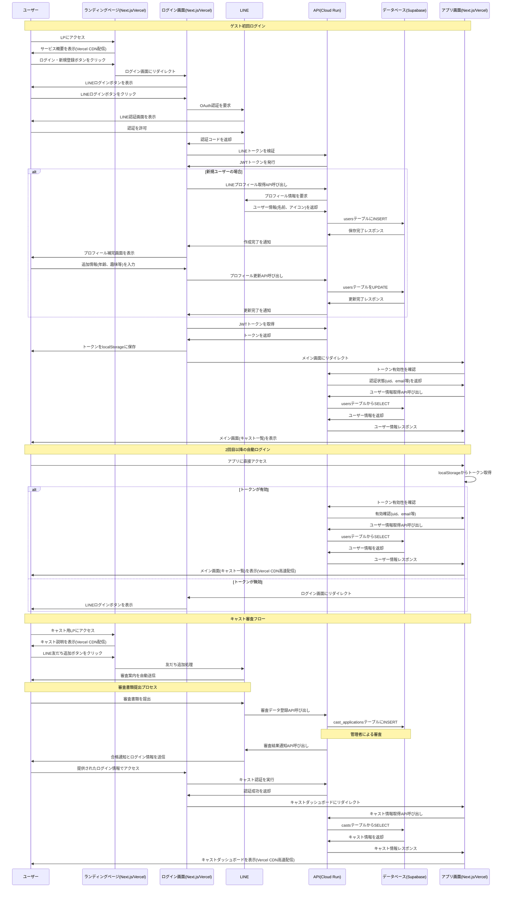

# Capu システム シークエンス図

## 概要
このドキュメントはCapuシステムにおける主要な処理フローを時系列で示したシークエンス図です。ユーザーの初回ログインから自動ログイン、キャスト審査までの一連の流れを詳細に記載しています。

## 全体フロー

## 主要フローの説明

### 1. ゲスト初回ログイン
- **目的**: 新規ユーザーがLINE認証を通じてアカウントを作成し、アプリにログインする
- **ポイント**: 
  - LINE OAuth認証の実装
  - Cloud Run認証APIとSupabaseの連携
  - 新規ユーザーのプロフィール補完フロー

### 2. 2回目以降の自動ログイン
- **目的**: 既存ユーザーがトークンベースで自動的にログインする
- **ポイント**:
  - localStorageからのトークン取得
  - トークン有効性の確認とフォールバック処理
  - Vercel CDNによる高速配信

### 3. キャスト審査フロー
- **目的**: キャスト志望者の審査プロセスを管理する
- **ポイント**:
  - LINE友だち追加による審査開始
  - 審査書類の提出と管理
  - 合格通知とキャストダッシュボードへの誘導

## 技術要素

### 認証・セキュリティ
- **LINE OAuth**: ユーザー認証の基盤
- **Cloud Run Auth API**: JWT管理とセキュリティ
- **localStorageトークン**: セッション管理

### データ管理
- **Supabase**: メインデータベース
- **テーブル構成**:
  - `users`: ユーザー情報
  - `casts`: キャスト情報
  - `cast_applications`: キャスト申請情報

### パフォーマンス
- **Vercel CDN**: 静的コンテンツの高速配信
- **Cloud Run**: コンテナベースのサーバーレス処理による効率化

## 注意事項

1. **セキュリティ**: 全ての認証フローでHTTPS通信を使用
2. **可用性**: トークン無効時の適切なフォールバック処理
3. **ユーザビリティ**: 新規ユーザー向けのスムーズなオンボーディング
4. **審査管理**: キャスト審査の透明性とトレーサビリティ