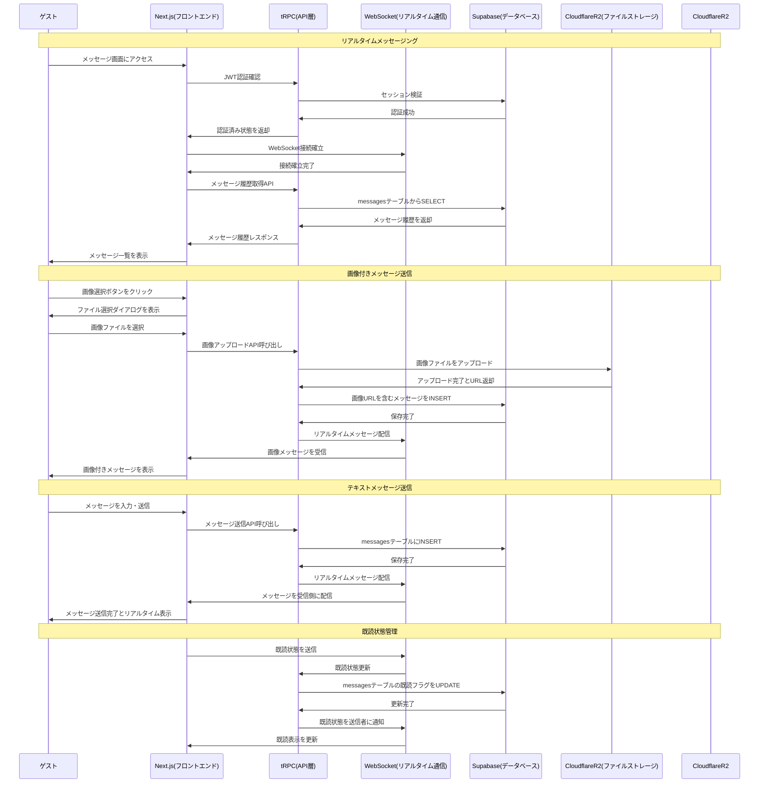
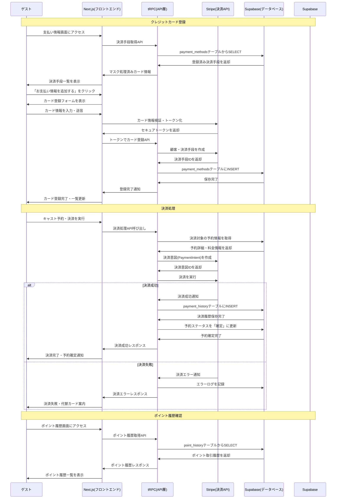
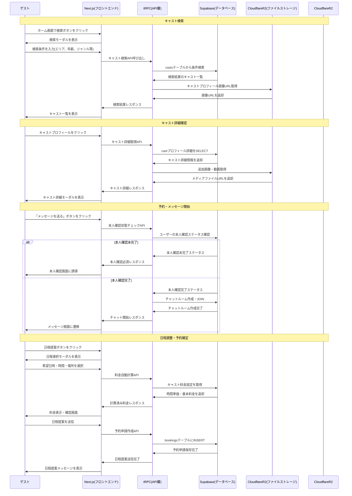
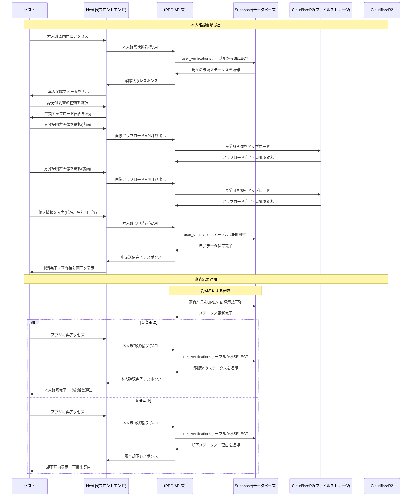
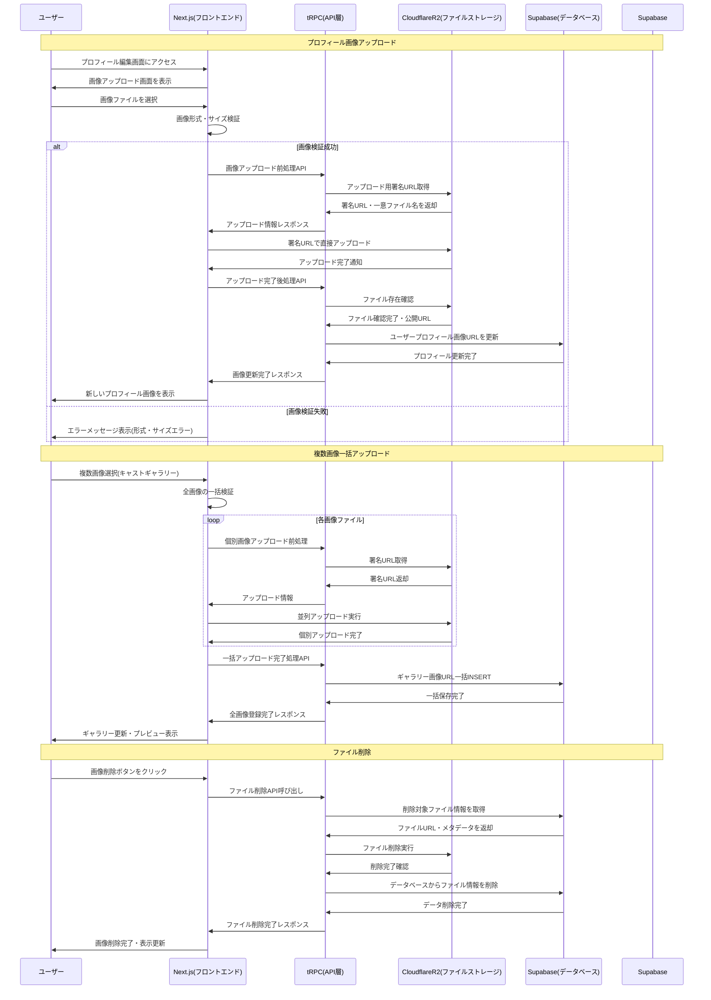

# Capu 業務フローシーケンス図

## 概要
このドキュメントは、Capuシステムにおける主要な業務フローを詳細なシーケンス図で示したものです。システム構成図.mdで定義されたアーキテクチャを基に、実際のユーザー操作から各システムコンポーネントの連携までを時系列で記載しています。

## 1. メッセージング業務フロー

## 2. 決済・ポイント業務フロー

## 3. キャスト検索・予約業務フロー

## 4. 本人確認業務フロー

## 5. ファイルアップロード業務フロー

## 業務フローの技術的特徴

### 1. 型安全性の確保
- **tRPC**: フロントエンドからバックエンドまで完全型安全
- **Prisma ORM**: データベースアクセスの型安全性
- **TypeScript**: 全層での静的型チェック

### 2. リアルタイム通信
- **WebSocket**: メッセージング、通知のリアルタイム配信
- **Server-Sent Events**: ライブ更新の効率的な実装
- **楽観的UI更新**: ユーザビリティ向上

### 3. セキュリティ対策
- **JWT認証**: ステートレスな認証管理
- **OAuth 2.0**: LINE認証による信頼性確保
- **署名URL**: ファイルアップロードのセキュリティ
- **入力検証**: 全API層でのバリデーション

### 4. パフォーマンス最適化
- **CDN活用**: Vercel、Cloudflare R2での高速配信
- **並列処理**: 複数ファイルの同時アップロード
- **キャッシュ戦略**: 頻繁にアクセスされるデータの最適化
- **遅延読み込み**: 必要な時点でのリソース取得

### 5. 可用性・拡張性
- **サーバーレス**: 自動スケーリングによる可用性確保
- **マイクロサービス**: 独立したコンポーネント設計
- **エラーハンドリング**: 段階的な機能縮退
- **フォールバック機能**: 障害時の代替処理

## 注意事項

1. **認証管理**: 全業務フローでJWT認証が前提
2. **ファイルサイズ制限**: アップロード時の適切な制限設定
3. **レート制限**: API呼び出し頻度の制御
4. **監視・ログ**: 各業務フローでの適切なログ収集
5. **GDPR対応**: 個人データの適切な管理・削除

---

**作成日**: 2024年12月  
**更新日**: 2024年12月  
**作成者**: Capu開発チーム  
**関連ドキュメント**: [システム構成図.md](./システム構成図.md), [シーケンス図.md](./シーケンス図.md) 