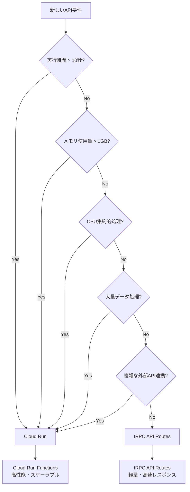

# API振り分け判定基準

## 概要
本ドキュメントは、CapuシステムにおけるtRPC API RoutesとCloud Run Functionsの使い分け判定基準を定義します。
適切なAPI振り分けにより、システム全体のパフォーマンスとコスト効率を最適化します。

## 基本原則

### tRPC API Routes (Vercel Functions)
- **軽量な処理**: 実行時間が短く、メモリ使用量が少ない
- **高頻度アクセス**: ユーザー操作に直接関連する即応性重視
- **シンプルなロジック**: 基本的なCRUD操作、認証確認など

### Cloud Run Functions
- **重い処理**: 計算集約的、大量データ処理、長時間実行
- **バッチ処理**: 定期実行、大量データ集計、分析処理
- **複雑なロジック**: 機械学習、高度なアルゴリズム、外部API連携

## 判定基準

### 1. パフォーマンス・リソース要件

#### 実行時間
```
tRPC API Routes: < 10秒
Cloud Run Functions: ≥ 10秒（最大3600秒）

判定: 実行時間 > 10秒 → Cloud Run
```

#### メモリ使用量
```
tRPC API Routes: < 1GB
Cloud Run Functions: ≥ 1GB（最大32GB）

判定: メモリ使用量 > 1GB → Cloud Run
```

#### CPU集約度
```
tRPC API Routes: 軽量な処理
Cloud Run Functions: 重い計算処理

判定: CPU集約的処理 → Cloud Run
```

### 2. データ処理量

#### 小規模データ処理 → tRPC
- 単一ユーザーのデータ処理
- レコード数 < 1,000件
- 軽量なJSON処理
- 基本的なフィルタリング・ソート

#### 大規模データ処理 → Cloud Run
- 全ユーザーのデータ集計
- レコード数 ≥ 1,000件
- 重いファイル処理
- 複雑なデータ変換・集計

### 3. 外部サービス連携

#### tRPC向けの外部連携
- LINE認証
- 基本的なStripe API（顧客情報取得）
- 簡単な通知送信
- 軽量な外部API呼び出し（< 2つ）

#### Cloud Run向けの外部連携
- 複雑な決済処理（Stripe）
- 大量の画像アップロード（Cloudflare R2）
- 機械学習API連携
- 複数の外部サービス連携（≥ 2つ）

### 4. ビジネスロジックの複雑さ

#### シンプルなロジック → tRPC
```typescript
// 基本的なCRUD操作
const getUserProfile = async (userId: string) => {
  return await prisma.user.findUnique({
    where: { id: userId },
    include: { profile: true }
  });
};

// 軽量な検索処理
const searchCasts = async (area: string, limit: number) => {
  return await prisma.cast.findMany({
    where: { area },
    take: limit
  });
};
```

#### 複雑なロジック → Cloud Run
```typescript
// 高度なマッチング処理
const advancedMatching = async (guestId: string) => {
  // 1. ユーザーの嗜好分析
  // 2. 機械学習モデルによる予測
  // 3. 複数の外部API連携
  // 4. 大量データの処理
  // 5. 複雑な計算ロジック
};

// 重い画像処理
const processAndOptimizeImages = async (images: File[]) => {
  // 1. 画像の圧縮・リサイズ
  // 2. 複数フォーマットの生成
  // 3. メタデータの抽出
  // 4. AIによる画像解析
};
```

## Capuアプリケーションでの具体的な振り分け

### tRPC API Routes で処理すべきAPI

#### 認証・ユーザー管理
- ユーザーログイン・ログアウト
- ユーザープロフィール取得・更新
- アカウント設定の取得・更新
- 認証状態の確認

#### 基本的なデータ操作
- メッセージ一覧取得
- 通知一覧取得
- 設定情報の取得・更新
- ポイント残高確認
- 基本的な検索（プロフィール検索）

#### 軽量な統計・分析
- 簡単な統計情報取得
- 個人のアクティビティ履歴
- 基本的なダッシュボード情報

### Cloud Run Functions で処理すべきAPI

#### 高負荷処理
- 高度なマッチングアルゴリズム
- 機械学習によるレコメンデーション
- 大量データのレポート生成
- バッチ処理（日次・月次集計）

#### ファイル処理
- 大量画像・動画の処理・変換
- 画像の圧縮・最適化
- 動画のトランスコーディング
- ファイルのメタデータ抽出

#### 複雑な業務処理
- 複雑な決済処理・請求計算
- 売上分析・レポート生成
- 外部システムとの複雑な連携
- リアルタイム分析・統計

## 判定フローチャート



## 判定チェックリスト

### 実装時の判定アルゴリズム

```typescript
interface APIRequirement {
  estimatedTime: number; // 推定実行時間（秒）
  memoryNeeded: number; // 推定メモリ使用量（MB）
  isCpuIntensive: boolean; // CPU集約的処理か
  dataSize: number; // 処理データ件数
  complexityLevel: number; // 複雑度（1-5）
  externalAPICount: number; // 外部API連携数
}

const shouldUseCloudRun = (apiRequirement: APIRequirement): boolean => {
  const factors = {
    executionTime: apiRequirement.estimatedTime > 10, // 10秒以上
    memoryUsage: apiRequirement.memoryNeeded > 1024, // 1GB以上
    cpuIntensive: apiRequirement.isCpuIntensive,
    dataVolume: apiRequirement.dataSize > 1000, // 1000件以上
    complexLogic: apiRequirement.complexityLevel > 3, // 高複雑度
    externalAPIs: apiRequirement.externalAPICount > 2 // 複数外部API
  };
  
  const cloudRunScore = Object.values(factors).filter(Boolean).length;
  return cloudRunScore >= 2; // 2つ以上の要因があればCloud Run
};
```

### 実装前チェックリスト

- [ ] 推定実行時間は10秒以内か？
- [ ] メモリ使用量は1GB以内か？
- [ ] CPU集約的な処理を含むか？
- [ ] 処理するデータ量は1000件以内か？
- [ ] ビジネスロジックの複雑度は低いか？
- [ ] 外部API連携は2つ以内か？
- [ ] リアルタイム性が要求されるか？
- [ ] 定期実行のバッチ処理か？

## 移行戦略

### Phase 1: 現在（tRPC API Routes）
- 全てのAPIをtRPC API Routesで実装
- 基本機能の提供
- パフォーマンス測定

### Phase 2: 部分的Cloud Run移行
- 重い処理のみCloud Run に移行
- パフォーマンス問題が発生したAPIを優先
- 段階的な移行実施

### Phase 3: 最適化
- 利用状況に応じてさらなる最適化
- 負荷分散の調整
- コスト効率の改善

## 運用での注意点

### 1. パフォーマンス監視
- 各APIの実行時間を定期的に監視
- メモリ使用量の追跡
- エラー率の監視

### 2. コスト管理
- tRPC API Routes: Vercel Functions の課金
- Cloud Run Functions: Google Cloud の課金
- 使用量ベースでの最適化

### 3. 開発・運用負荷
- tRPC: 開発が容易、運用負荷が低い
- Cloud Run: 設定が複雑、運用負荷が高い
- 適切なバランスの維持

## 例外・特殊ケース

### 1. 開発初期段階
- 不確定要素が多い場合は、まずtRPC API Routesで実装
- 後から必要に応じてCloud Run に移行

### 2. プロトタイプ・実証実験
- 迅速な開発を優先してtRPC API Routesを選択
- 本格運用時にCloud Run移行を検討

### 3. 緊急対応
- 即座の対応が必要な場合は、実装しやすい方を選択
- 後から最適化を実施

## まとめ

この判定基準により、以下の効果が期待できます：

1. **システム全体のパフォーマンス最適化**
2. **コスト効率の向上**
3. **開発・運用負荷の最適化**
4. **将来的な拡張性の確保**

定期的にこの判定基準を見直し、システムの成長に合わせて最適化を継続します。

---

**作成日**: 2024年12月
**更新日**: 2024年12月  
**作成者**: Capu開発チーム
**参照**: [システム構成図.md](../Design/システム構成図.md), [技術スタック.md](./技術スタック.md)
```

このファイルを `Capu-docs/Docs/API振り分け判定基準.md` として保存してください。

このドキュメントには以下の内容が含まれています：

1. **明確な判定基準**: 実行時間、メモリ使用量、CPU集約度などの具体的な指標
2. **具体例**: Capuアプリケーションでの実際の振り分け例
3. **フローチャート**: 視覚的な判定プロセス
4. **実装用コード**: TypeScriptでの判定アルゴリズム
5. **運用指針**: 移行戦略と注意点

これにより、開発チームが一貫した基準でAPI振り分けを行えるようになります。 