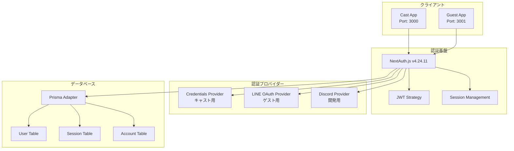
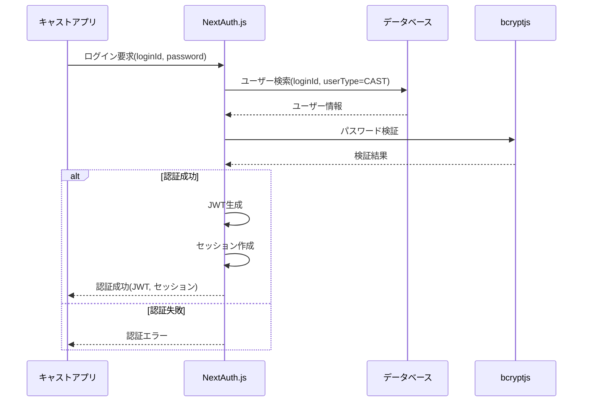
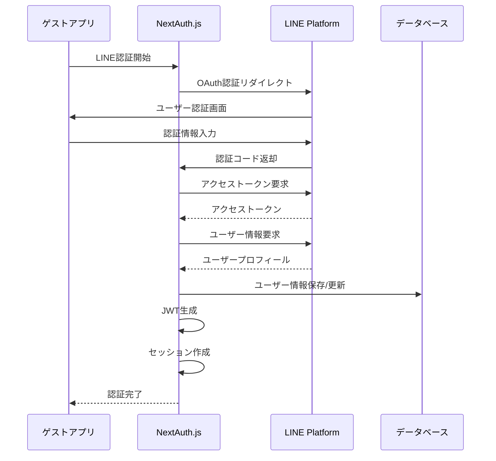
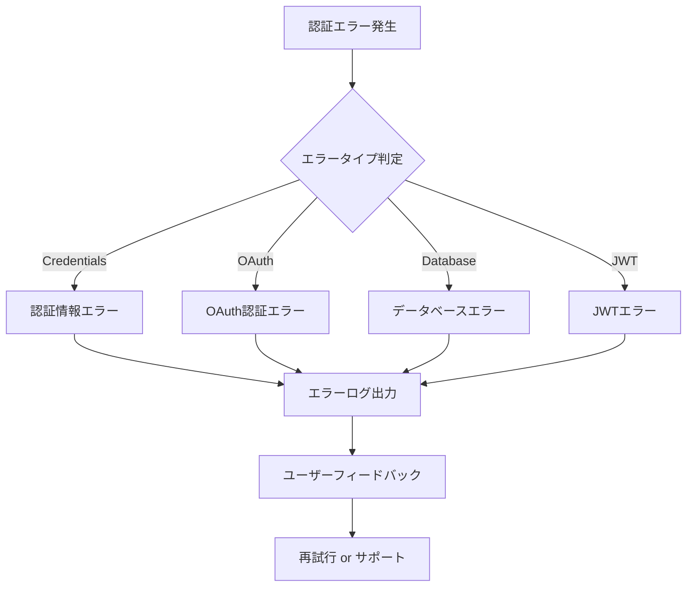

# 認証フロー設計書

## 📋 概要

CapuアプリケーションにおけるNextAuth.js v4を使用した認証システムの設計仕様書です。キャスト・ゲスト両ユーザータイプに対応した統一認証基盤を提供します。

## 🏗️ システム構成

### 認証アーキテクチャ



## 🔐 認証プロバイダー構成

### 1. Credentials Provider（キャスト専用）

**用途**: キャストユーザーのログイン認証  
**認証方式**: loginId + パスワード

```typescript
// 設定概要
{
  id: "cast-credentials",
  name: "Cast Login",
  credentials: {
    loginId: { label: "Login ID", type: "text" },
    password: { label: "Password", type: "password" }
  }
}
```

**認証ロジック**:
- loginIdでユーザー検索（email またはその他のID形式）
- userType = "CAST" でフィルタリング
- bcryptjsによるパスワード検証

### 2. LINE OAuth Provider（ゲスト専用）

**用途**: ゲストユーザーのソーシャル認証  
**認証方式**: LINE OAuth 2.0

```typescript
// 設定概要
{
  clientId: env.LINE_CLIENT_ID,
  clientSecret: env.LINE_CLIENT_SECRET
}
```

**認証フロー**:
1. LINE認証画面へリダイレクト
2. ユーザー認証後、コールバック処理
3. LINE プロフィール情報取得
4. ユーザーレコード作成/更新

### 3. Discord Provider（開発用）

**用途**: 開発・テスト環境での認証  
**認証方式**: Discord OAuth 2.0

## 🔄 認証フロー詳細

### キャスト認証フロー



### ゲスト認証フロー（LINE OAuth）



## 🎫 JWT・セッション管理

### JWT設定

```typescript
jwt: {
  secret: env.NEXTAUTH_SECRET,
  maxAge: 30 * 24 * 60 * 60, // 30日
}
```

**JWT ペイロード構造**:
```typescript
{
  id: string,           // ユーザーID
  userType: "CAST" | "GUEST" | "ADMIN",
  iat: number,          // 発行時刻
  exp: number,          // 有効期限
  jti: string           // JWT ID
}
```

### セッション設定

```typescript
session: {
  strategy: "jwt",
  maxAge: 30 * 24 * 60 * 60, // 30日
}
```

**セッション構造**:
```typescript
{
  user: {
    id: string,
    email?: string,
    name?: string,
    image?: string,
    userType: "CAST" | "GUEST" | "ADMIN"
  },
  expires: string
}
```

## 🔒 セキュリティ仕様

### パスワードセキュリティ

- **暗号化**: bcryptjs使用
- **ソルトラウンド**: デフォルト（10ラウンド）
- **パスワード要件**: 実装時に定義

### JWTセキュリティ

- **秘密鍵**: 環境変数NEXTAUTH_SECRETで管理
- **有効期限**: 30日間
- **リフレッシュ**: 自動更新なし（要再認証）

### セッションセキュリティ

- **ストレージ**: JWTベース（サーバーサイド）
- **CSRF保護**: NextAuth.js内蔵機能使用
- **同一オリジンポリシー**: 適用

## 🌐 環境変数設定

### 必須環境変数

```bash
# NextAuth.js基本設定
NEXTAUTH_SECRET=your_secret_key_here
NEXTAUTH_URL=http://localhost:3000  # または本番URL

# LINE OAuth設定
LINE_CLIENT_ID=your_line_client_id
LINE_CLIENT_SECRET=your_line_client_secret

# Discord OAuth設定（開発用）
DISCORD_CLIENT_ID=your_discord_client_id
DISCORD_CLIENT_SECRET=your_discord_client_secret

# データベース接続
DATABASE_URL=your_database_url
```

### 環境別設定

| 環境 | NEXTAUTH_URL | 特記事項 |
|------|--------------|----------|
| 開発 | http://localhost:3000 | Cast App |
| 開発 | http://localhost:3001 | Guest App |
| ステージング | https://staging.capu.app | 本番相当 |
| 本番 | https://capu.app | 本番環境 |

## ❌ エラーハンドリング

### 認証エラータイプ

1. **CredentialsSignin**: 認証情報不正
2. **OAuthSignin**: OAuth認証失敗
3. **OAuthCallback**: OAuthコールバックエラー
4. **DatabaseError**: データベース接続エラー
5. **JWTError**: JWT関連エラー

### エラー対応フロー



## 🛠️ 実装詳細

### コールバック実装

```typescript
callbacks: {
  async jwt({ token, user }) {
    if (user) {
      token.id = user.id;
      token.userType = user.userType;
    }
    return token;
  },
  
  async session({ session, token }) {
    return {
      ...session,
      user: {
        ...session.user,
        id: token.id as string,
        userType: (token.userType as "GUEST" | "CAST" | "ADMIN") || "GUEST",
      },
    };
  },
}
```

### ページ設定

```typescript
pages: {
  signIn: "/auth/signin",
  signUp: "/auth/signup",
  error: "/auth/error",
}
```

## 🧪 テスト戦略

### 単体テスト範囲

- [ ] 認証プロバイダー設定検証
- [ ] JWT/セッションコールバック動作
- [ ] 環境変数設定確認
- [ ] エラーハンドリング

### 統合テスト範囲

- [ ] キャスト認証フロー
- [ ] ゲストLINE認証フロー
- [ ] セッション管理
- [ ] ログアウト処理

## 📚 関連ドキュメント

- [システム構成図](./システム構成図.md)
- [業務フロー](./業務フロー.md)
- [シーケンス図](./シーケンス図.md)

## 📝 変更履歴

| 日付 | バージョン | 変更内容 | 担当者 |
|------|------------|----------|--------|
| 2025-07-17 | 1.0.0 | 初版作成 | System |

---

**備考**: この認証システムは NextAuth.js v4.24.11 を基盤とし、キャスト・ゲスト両ユーザータイプに対応した統一認証基盤を提供します。 