# Capu テーブル構成図

## 概要

本ドキュメントは、Capuアプリケーションのデータベーステーブル構成を視覚的に表現したER図（Entity Relationship Diagram）です。

**作成日**: 2024年12月
**参照元**: 
- `docs/designs/API一覧.md`
- `prisma/schema.prisma`

**技術スタック**: PostgreSQL + Prisma ORM

---

## テーブル構成図

```mermaid
erDiagram
    %% Core User Management
    User {
        string id PK
        string email UK
        UserType userType
        datetime createdAt
        datetime updatedAt
    }
    
    Account {
        string id PK
        string userId FK
        string type
        string provider
        string providerAccountId
        string refresh_token
        string access_token
    }
    
    Session {
        string id PK
        string sessionToken UK
        string userId FK
        datetime expires
    }
    
    VerificationToken {
        string identifier
        string token UK
        datetime expires
    }

    %% Profile Management
    CastProfile {
        string id PK
        string userId FK
        string displayName
        string bio
        string avatar
        string coverImage
        int hourlyRate
        json availability
        string[] specialties
        boolean isActive
        boolean isVerified
        string areaId FK
        string categoryId FK
        datetime createdAt
        datetime updatedAt
    }
    
    GuestProfile {
        string id PK
        string userId FK
        string displayName
        string avatar
        string bio
        json preferences
        string location
        datetime createdAt
        datetime updatedAt
    }

    %% Booking & Conversation System
    Booking {
        string id PK
        string guestId FK
        string castId FK
        string title
        string description
        string serviceType
        datetime startDateTime
        datetime endDateTime
        int durationMinutes
        int hourlyRate
        int totalAmount
        BookingStatus status
        datetime createdAt
        datetime updatedAt
    }
    
    Conversation {
        string id PK
        string bookingId FK
        string title
        boolean isGroup
        boolean isActive
        datetime createdAt
        datetime updatedAt
    }
    
    Message {
        string id PK
        string conversationId FK
        string senderId FK
        string content
        MessageType messageType
        boolean isRead
        boolean isDeleted
        datetime readAt
        datetime createdAt
        datetime updatedAt
    }
    
    MessageAttachment {
        string id PK
        string messageId FK
        string fileName
        string fileUrl
        string fileType
        int fileSize
        string thumbnailUrl
        datetime createdAt
    }
    
    MessageReadStatus {
        string id PK
        string messageId FK
        string userId FK
        datetime readAt
    }

    %% Payment System
    Payment {
        string id PK
        string bookingId FK
        string payerId FK
        int amount
        float platformFeeRate
        int platformFee
        int castAmount
        string stripePaymentIntentId
        string stripeCustomerId
        string stripeChargeId
        PaymentStatus status
        datetime paidAt
        datetime createdAt
        datetime updatedAt
    }
    
    Payout {
        string id PK
        string paymentId FK
        string castId FK
        int amount
        string stripeTransferId
        string stripeAccountId
        PayoutStatus status
        datetime paidAt
        datetime createdAt
        datetime updatedAt
    }
    
    TransactionLog {
        string id PK
        string paymentId FK
        string payoutId FK
        TransactionAction action
        string status
        int amount
        string description
        string externalId
        json externalData
        string errorCode
        string errorMessage
        datetime createdAt
    }

    %% Master Data
    Area {
        string id PK
        string name
        string nameEn
        string code UK
        string parentId FK
        float latitude
        float longitude
        int sortOrder
        boolean isActive
        datetime createdAt
        datetime updatedAt
    }
    
    Category {
        string id PK
        string name
        string nameEn
        string code UK
        string parentId FK
        string icon
        string color
        string description
        int sortOrder
        boolean isActive
        datetime createdAt
        datetime updatedAt
    }
    
    Tag {
        string id PK
        string name UK
        string nameEn
        TagType type
        string color
        string description
        int usageCount
        int sortOrder
        boolean isActive
        datetime createdAt
        datetime updatedAt
    }
    
    Configuration {
        string id PK
        string key UK
        string value
        ConfigType type
        string category
        string description
        boolean isRequired
        boolean isSecret
        datetime createdAt
        datetime updatedAt
    }

    %% Review & Rating System
    Review {
        string id PK
        string castId FK
        string guestId FK
        string authorId FK
        string bookingId FK
        int rating
        string comment
        boolean isPublic
        boolean isReported
        datetime createdAt
        datetime updatedAt
    }

    %% Notification System
    Notification {
        string id PK
        string userId FK
        string title
        string body
        json data
        NotificationType type
        NotificationChannel channel
        NotificationPriority priority
        boolean isRead
        datetime readAt
        boolean isDelivered
        datetime deliveredAt
        string relatedId
        string relatedType
        datetime createdAt
        datetime updatedAt
    }
    
    NotificationSetting {
        string id PK
        string userId FK
        NotificationType notificationType
        boolean pushEnabled
        boolean emailEnabled
        boolean smsEnabled
        string quietHoursStart
        string quietHoursEnd
        datetime createdAt
        datetime updatedAt
    }
    
    DeviceToken {
        string id PK
        string userId FK
        string token UK
        DevicePlatform platform
        string appVersion
        json deviceInfo
        boolean isActive
        datetime createdAt
        datetime updatedAt
    }

    %% Other Features
    Favorite {
        string id PK
        string guestId FK
        string castId FK
        datetime createdAt
    }
    
    File {
        string id PK
        string fileName
        string fileType
        int fileSize
        string fileKey UK
        FileCategory category
        boolean isPublic
        FileStatus status
        string uploadedBy FK
        string thumbnailKey
        boolean hasThumbnail
        datetime uploadedAt
        datetime createdAt
        datetime updatedAt
    }
    
    SearchHistory {
        string id PK
        string userId FK
        string query
        json filters
        string name
        datetime createdAt
    }
    
    ActivityLog {
        string id PK
        string userId FK
        string action
        string entity
        string entityId
        string description
        json metadata
        string ipAddress
        string userAgent
        LogLevel level
        datetime createdAt
    }
    
    Report {
        string id PK
        ReportType type
        ReportFormat format
        json dateRange
        string generatedBy FK
        json data
        datetime createdAt
    }

    %% Relationships
    User ||--o{ Account : has
    User ||--o{ Session : has
    User ||--o| CastProfile : has
    User ||--o| GuestProfile : has
    User ||--o{ Booking : "guest_bookings"
    User ||--o{ Booking : "cast_bookings"
    User ||--o{ Message : sends
    User ||--o{ Payment : pays
    User ||--o{ Payout : receives
    User ||--o{ Notification : receives
    User ||--o{ NotificationSetting : has
    User ||--o{ DeviceToken : has
    User ||--o{ Review : writes
    User ||--o{ Favorite : has
    User ||--o{ File : uploads
    User ||--o{ SearchHistory : has
    User ||--o{ ActivityLog : generates
    User ||--o{ Report : generates
    User ||--o{ MessageReadStatus : has
    User ||--o{ Conversation : participates

    CastProfile ||--o{ Review : "receives_reviews"
    CastProfile ||--o{ Favorite : "favorited_by"
    CastProfile }o--|| Area : "located_in"
    CastProfile }o--|| Category : "belongs_to"
    CastProfile }o--o{ Tag : "tagged_with"

    GuestProfile ||--o{ Review : "writes_reviews"

    Booking ||--|| Payment : "paid_by"
    Booking ||--o| Conversation : "discussed_in"
    Booking ||--o| Review : "reviewed_by"

    Conversation ||--o{ Message : contains

    Message ||--o{ MessageAttachment : has
    Message ||--o{ MessageReadStatus : "read_by"

    Payment ||--o| Payout : "paid_out_as"
    Payment ||--o{ TransactionLog : "logged_as"
    Payout ||--o{ TransactionLog : "logged_as"

    Area ||--o{ Area : "parent_child"
    Category ||--o{ Category : "parent_child"
```

---

## ドメイン別テーブル解説

### 1. 認証・ユーザー管理ドメイン

| テーブル名 | 説明 | 対応API Router |
|:---|:---|:---|
| `User` | メインユーザーテーブル（キャスト・ゲスト共通） | `auth`, `user` |
| `Account` | NextAuth.js外部プロバイダー連携情報 | `auth` |
| `Session` | ユーザーセッション管理 | `auth` |
| `VerificationToken` | メール認証等のトークン管理 | `auth` |
| `CastProfile` | キャスト専用プロフィール情報 | `cast`, `user` |
| `GuestProfile` | ゲスト専用プロフィール情報 | `guest`, `user` |

### 2. 予約・メッセージングドメイン

| テーブル名 | 説明 | 対応API Router |
|:---|:---|:---|
| `Booking` | 予約・サービス実行情報 | `cast`, `guest` |
| `Conversation` | メッセージ会話ルーム | `message` |
| `Message` | 個別メッセージデータ | `message` |
| `MessageAttachment` | メッセージ添付ファイル | `message` |
| `MessageReadStatus` | メッセージ既読状態 | `message` |

### 3. 決済・収益管理ドメイン

| テーブル名 | 説明 | 対応API Router |
|:---|:---|:---|
| `Payment` | 決済処理・Stripe連携 | `guest` |
| `Payout` | キャストへの支払い処理 | `cast` |
| `TransactionLog` | 取引ログ・監査証跡 | `cast`, `guest` |

### 4. マスターデータドメイン

| テーブル名 | 説明 | 対応API Router |
|:---|:---|:---|
| `Area` | 地域マスター（階層構造） | `content` |
| `Category` | カテゴリマスター（階層構造） | `content` |
| `Tag` | タグマスター（プロフィール用） | `content` |
| `Configuration` | システム設定値 | `content` |

### 5. レビュー・評価ドメイン

| テーブル名 | 説明 | 対応API Router |
|:---|:---|:---|
| `Review` | サービス評価・レビュー | `cast`, `guest` |

### 6. 通知・活動記録ドメイン

| テーブル名 | 説明 | 対応API Router |
|:---|:---|:---|
| `Notification` | プッシュ通知・メール通知 | `user` |
| `NotificationSetting` | 通知設定 | `user` |
| `DeviceToken` | プッシュ通知用デバイストークン | `user` |
| `ActivityLog` | ユーザー活動ログ | - |

### 7. その他機能ドメイン

| テーブル名 | 説明 | 対応API Router |
|:---|:---|:---|
| `Favorite` | お気に入り・ブックマーク | `user` |
| `File` | ファイル管理・アップロード | `user` |
| `SearchHistory` | 検索履歴 | `cast`, `guest` |
| `Report` | レポート生成 | `cast` |

---

## 主要な関係性

### ユーザーとプロフィール
- 1人のユーザーは、キャストまたはゲストのプロフィールを持つ（排他制御）
- `User.userType`で役割を判別

### 予約フロー
1. **ゲスト** → **キャスト** に予約申請（`Booking`作成）
2. 予約確定後、**決済処理**（`Payment`）が実行
3. **メッセージルーム**（`Conversation`）が自動作成
4. サービス完了後、**レビュー**（`Review`）投稿可能

### メッセージング
- 予約ベースの1対1チャット
- リアルタイム既読管理（`MessageReadStatus`）
- 画像・ファイル添付対応（`MessageAttachment`）

### 決済フロー
1. **ゲスト** → Stripe経由で決済（`Payment`）
2. プラットフォーム手数料差し引き後、**キャスト**に支払い（`Payout`）
3. 全取引は**監査ログ**（`TransactionLog`）で記録

---

## API Router との対応関係

### `auth` Router
- `User`, `Account`, `Session` テーブルを使用
- NextAuth.jsとの連携でセッション管理

### `user` Router  
- `User`, `CastProfile`, `GuestProfile`
- `Notification`, `NotificationSetting`, `DeviceToken`
- `Favorite`, `File`

### `cast` Router
- `CastProfile`, `Review`, `Payment`, `Payout`, `TransactionLog`
- `Booking`（キャスト側）

### `guest` Router
- `GuestProfile`, `Booking`（ゲスト側）
- `Payment`, `Favorite`

### `message` Router
- `Conversation`, `Message`, `MessageAttachment`, `MessageReadStatus`

### `content` Router
- `Area`, `Category`, `Tag`, `Configuration`

---

## インデックス戦略

### パフォーマンス重要テーブル

| テーブル | 主要インデックス | 用途 |
|:---|:---|:---|
| `CastProfile` | `(isActive, isVerified)`, `(areaId, categoryId)` | キャスト検索 |
| `Booking` | `(guestId, status)`, `(castId, status)` | 予約状況確認 |
| `Message` | `(conversationId, createdAt)` | メッセージ履歴取得 |
| `Payment` | `(payerId, status)`, `(paidAt)` | 決済履歴・集計 |
| `Notification` | `(userId, isRead)` | 未読通知取得 |

---

## 拡張予定

### 今後追加予定のテーブル

1. **ポイントシステム**
   - `Point` - ポイント残高・履歴
   - `PointTransaction` - ポイント取引記録

2. **銀行口座管理**
   - `BankAccount` - キャスト銀行口座情報

3. **本人確認**
   - `IdentityVerification` - 本人確認書類・ステータス

4. **クレジットカード管理**
   - `PaymentMethod` - ゲスト決済手段

5. **チャット拡張**
   - `MessagePin` - メッセージピン留め
   - `ScheduleProposal` - 日程提案

---

## 設計原則

### 1. セキュリティ
- 個人情報は暗号化対応
- 削除は論理削除（`isDeleted`フラグ）
- 監査証跡の完全保持

### 2. スケーラビリティ
- パーティショニング対応（日付ベース）
- 読み取り専用レプリカ対応
- キャッシュ戦略（Redis）

### 3. 整合性
- 外部キー制約による参照整合性
- トランザクション境界の明確化
- 楽観的排他制御（`updatedAt`）

---

*このドキュメントは開発進捗に応じて随時更新してください。* 