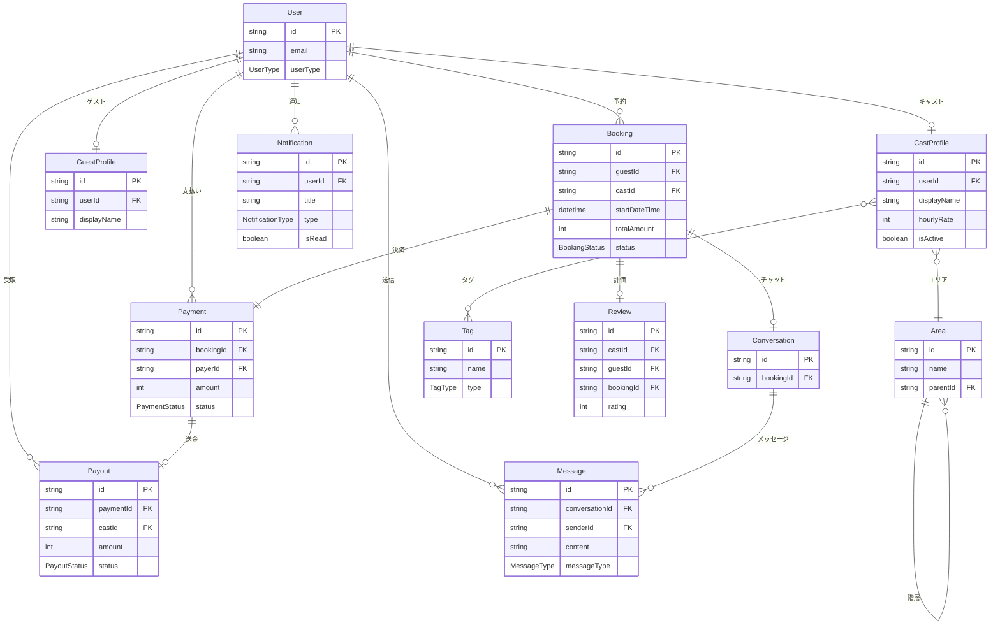

# Capu テーブル構成図（簡易版）

## 概要

Capuアプリケーションの主要テーブル構成を簡潔に表現したER図です。

**参照**: 詳細版は `テーブル構成図.md` をご覧ください

---

## 主要テーブル関係図



---

## ドメイン構成

### 🔐 認証・ユーザー管理
- **User** - メインユーザーテーブル
- **CastProfile** - キャスト情報
- **GuestProfile** - ゲスト情報

### 💼 予約・決済
- **Booking** - 予約管理
- **Payment** - 決済処理
- **Payout** - キャストへの支払い

### 💬 メッセージング
- **Conversation** - 会話ルーム
- **Message** - メッセージ

### 📊 マスターデータ
- **Area** - 地域情報
- **Tag** - タグ情報

### ⭐ その他重要機能
- **Review** - レビュー・評価
- **Notification** - 通知

---

## データフロー

### 1. 利用開始
```
ユーザー登録 → User作成 → プロフィール作成 (CastProfile/GuestProfile)
```

### 2. 予約フロー
```
ゲスト検索 → キャスト選択 → Booking作成 → Payment実行 → Conversation作成
```

### 3. サービス実行
```
Message交換 → サービス実行 → Booking完了 → Review投稿 → Payout実行
```

### 4. 通知
```
各種イベント → Notification作成 → プッシュ通知/メール送信
```

---

## API Router マッピング

| Router | 主要テーブル |
|:---|:---|
| `auth` | User, Account, Session |
| `user` | User, CastProfile, GuestProfile, Notification |
| `cast` | CastProfile, Booking, Payment, Payout |
| `guest` | GuestProfile, Booking, Payment |
| `message` | Conversation, Message |
| `content` | Area, Tag |

---

*詳細なテーブル定義・関係性については `テーブル構成図.md` をご確認ください。* 